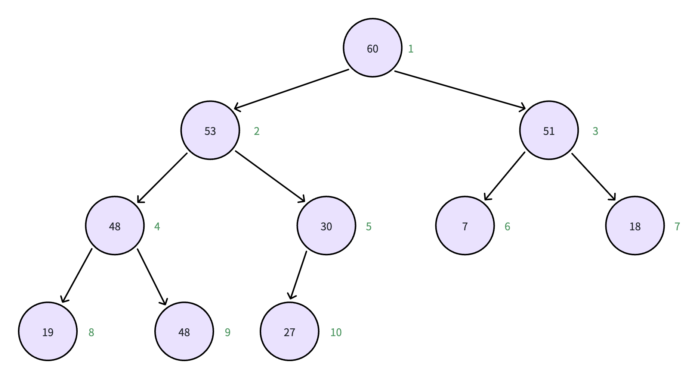

## 数据结构之堆：最大堆 & 最小堆

- 参考视频：https://www.bilibili.com/video/BV1HYtseiEQ8/

### 核心概念
- 堆（Heap） 是一种特殊的完全二叉树，满足堆序性质：
  - 最大堆：每个父节点的值 ≥ 其子节点的值，根节点为最大值
  - 最小堆：每个父节点的值 ≤ 其子节点的值，根节点为最小值

- 数组表示法：由于堆是完全二叉树，可用数组紧凑存储。对于索引 i：
  - 父节点索引：Math.floor(i / 2)
  - 左子节点索引：2 * i
  - 右子节点索引：2 * i + 1
